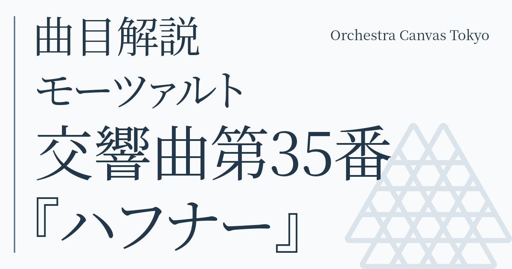
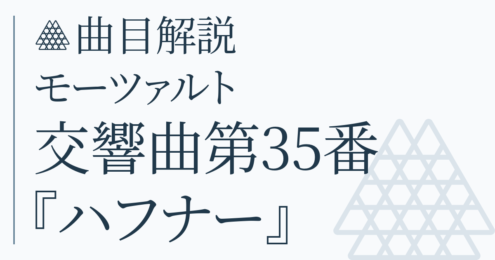
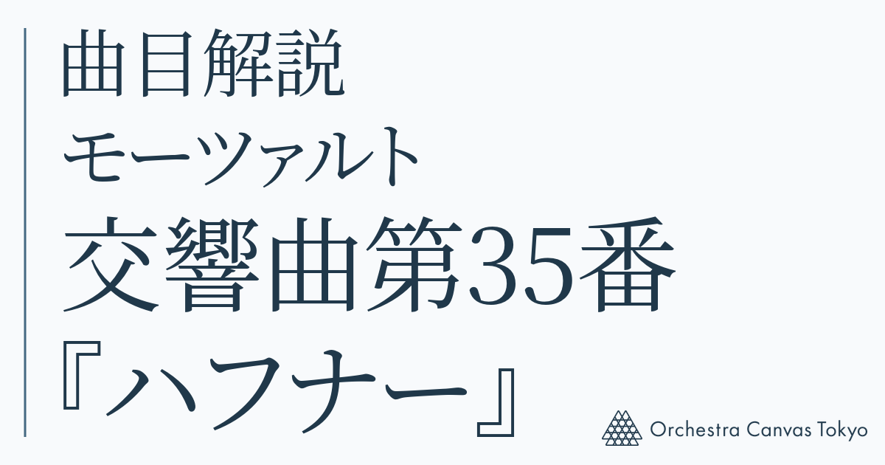
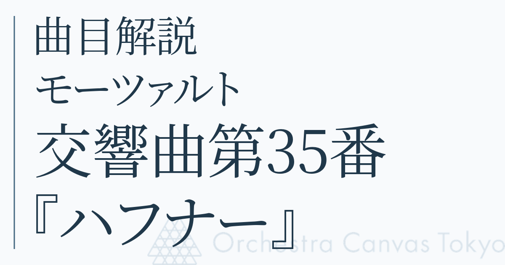
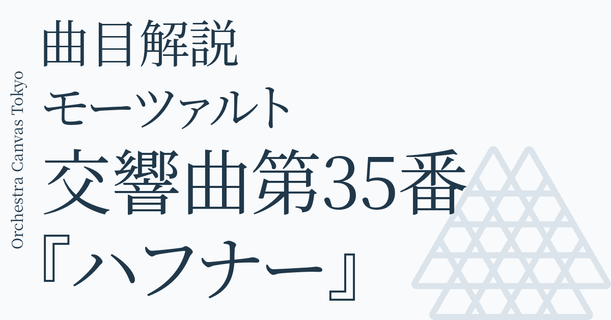

# OGP branding proposals

Five comparison-only proposals using the same Mozart/Haffner card. The active OGP renderer is unchanged.

## 1. top-right-name

## 2. heading-symbol

## 3. bottom-right-logo

## 4. logo-watermark

## 5. vertical-name

Regenerate with `node scripts/ogp/branding-options.mjs`.

The full logo is copied from `orchestra-canvas-tokyo/homepage/src/routes/logo.svg`; the icon and regular font are the existing OGP assets. After selection, check the chosen layout against all article titles before applying it to the live generator.
