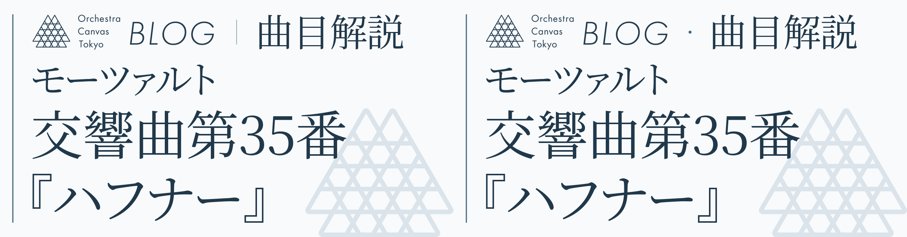

# ブログロゴ＋曲目解説：区切りの比較

## 120pxの余白で比較：左が細い縦線、右が中黒

同じ曲名・文字サイズで、区切りと要素間の余白を比較する案です。現行OGPには未適用です。

ロゴと「曲目解説」の実際の描画高さを94pxに揃え、上下中心も合わせています。文字サイズは作曲家名と同じ100px、元の3案の要素間は72pxです。追加の中黒案は96・120・144pxで、ロゴと文字のサイズは変えていません。要素間の距離には直径8pxの中黒を含み、点の左右の空白はそれぞれ44・56・68pxです。

## 1. 余白のみ

## 2. 細い縦線

## 3. 中黒

## 4. 中黒・要素間96px

## 5. 中黒・要素間120px

## 6. 中黒・要素間144px

## 7. 細い縦線・要素間120px

再生成：`node scripts/ogp/header-options.mjs`。ブログの既存SVGロゴを使用しています。
