# OGP review gallery

54 images: 53 published articles and the default sharing card.
Each preview is the exact 1200 × 630 PNG generated for deployment.

Article headers use the horizontal OCT logo, a middle dot in a 96px gap, and 曲目解説 aligned to the wordmark’s roman baseline, with Japanese ink approximately 8% taller than Latin capitals.

Review composer/title legibility, line breaks, equal vertical spacing, and the pale OCT logo at the bottom-right edge.
Keys and catalogue numbers are omitted only from sharing cards; article content is unchanged.

Regenerate with `npm run review:ogp`. Commit this index and its PNGs together.

## 1. default

Default card: centered blog logo only.

No title or tagline.

Logo centered horizontally and vertically.

[Full-size PNG](default.png)

## 2. 20220807-beethoven-symphony-01

Composer: ベートーヴェン

Card title: 交響曲第1番

Main title row: 1

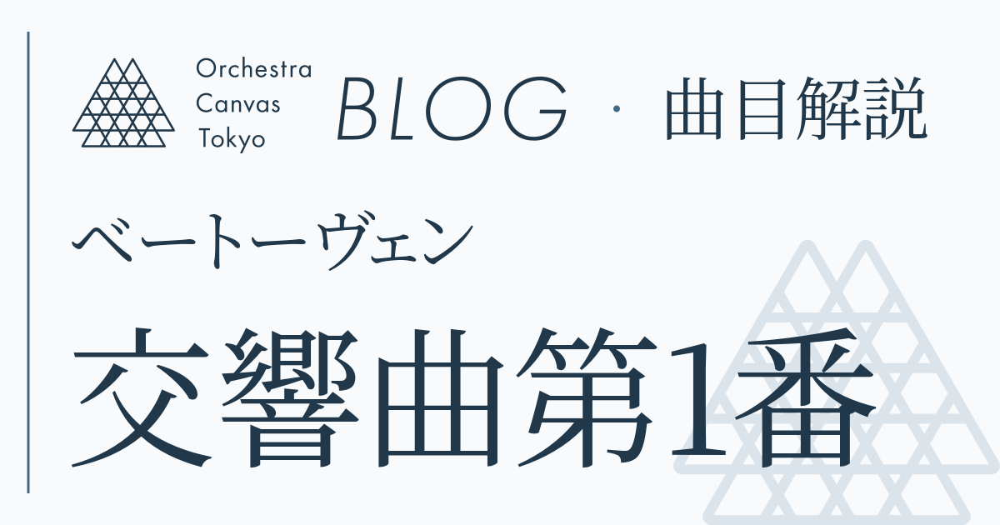

[Full-size PNG](20220807-beethoven-symphony-01.png)

## 3. 20220807-brahms-symphony-01

Composer: ブラームス

Card title: 交響曲第1番

Main title row: 1

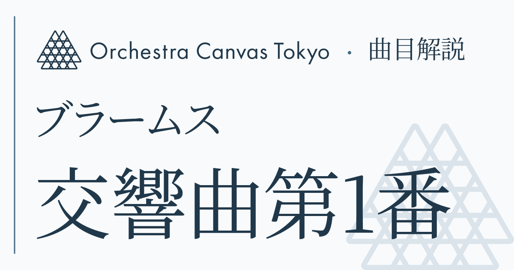

[Full-size PNG](20220807-brahms-symphony-01.png)

## 4. 20220807-les-preludes

Composer: リスト

Card title: 交響詩《前奏曲》

Main title row: 1

[Full-size PNG](20220807-les-preludes.png)

## 5. 20240629-prokofiev-piano-concerto-3

Composer: プロコフィエフ

Card title: ピアノ協奏曲第3番

Main title row: 1

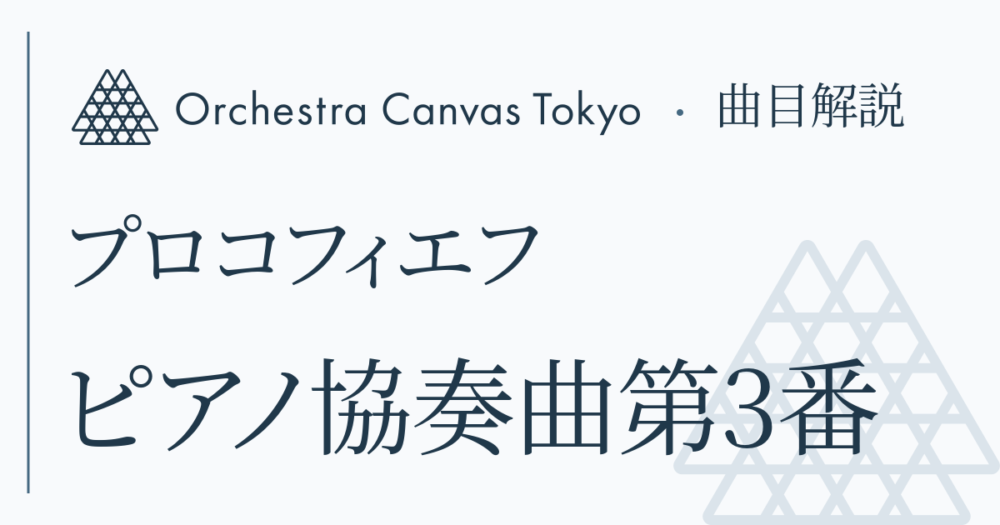

[Full-size PNG](20240629-prokofiev-piano-concerto-3.png)

## 6. 20240629-shostakovich-festival-overture

Composer: ショスタコーヴィチ

Card title: 祝典序曲

Main title row: 1

[Full-size PNG](20240629-shostakovich-festival-overture.png)

## 7. 20240629-shostakovich-symphony-10

Composer: ショスタコーヴィチ

Card title: 交響曲第10番

Main title row: 1

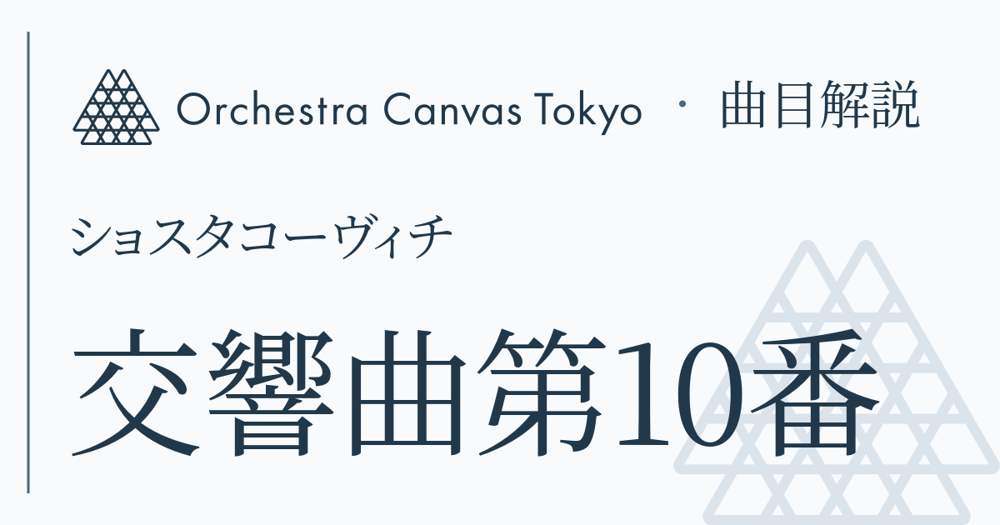

[Full-size PNG](20240629-shostakovich-symphony-10.png)

## 8. 20240909-about-movie-and-movie-music

Composer: 音楽コラム

Card title: 「映画」と「映画音楽」について

Main title row: 1

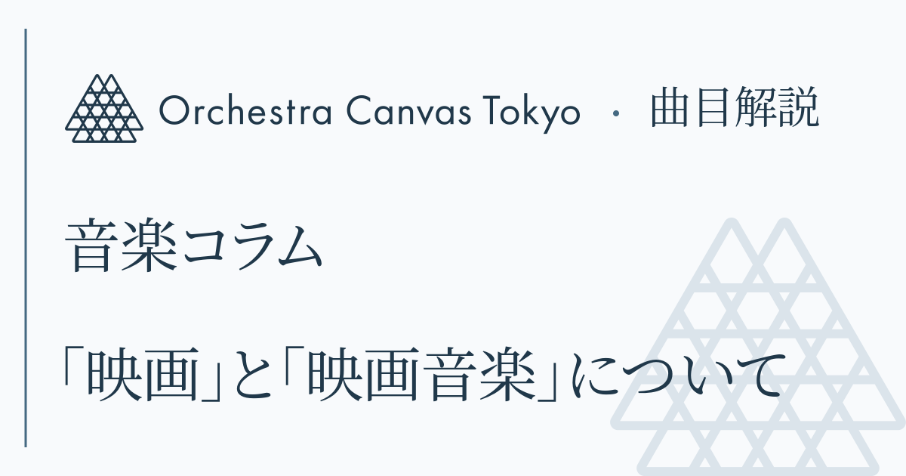

[Full-size PNG](20240909-about-movie-and-movie-music.png)

## 9. 20240909-my-neighbor-totoro

Composer: 久石譲

Card title: となりのトトロ

Main title row: 1

[Full-size PNG](20240909-my-neighbor-totoro.png)

## 10. 20240909-pirates-of-the-caribbean

Composer: クラウス・バデルト

Card title: 『パイレーツ・オブ・カリビアン』より

Main title row: 1

[Full-size PNG](20240909-pirates-of-the-caribbean.png)

## 11. 20240909-star-wars-suite

Composer: ジョン・ウィリアムズ

Card title: 『スター・ウォーズ』組曲

Main title row: 1

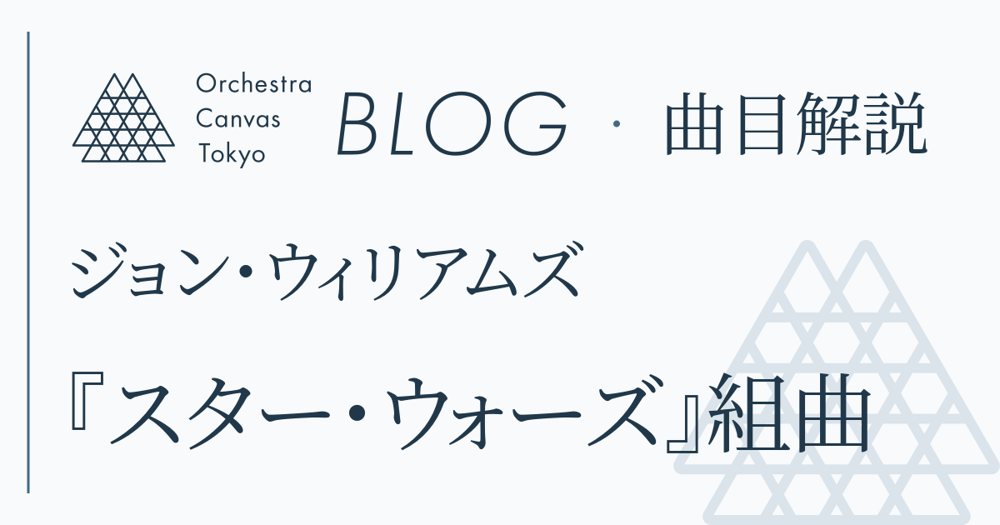

[Full-size PNG](20240909-star-wars-suite.png)

## 12. 20240909-symphonic-variations-merry-go-around

Composer: 久石譲

Card title: シンフォニック・バリエーション / 『メリーゴーランド』

Main title row: 1

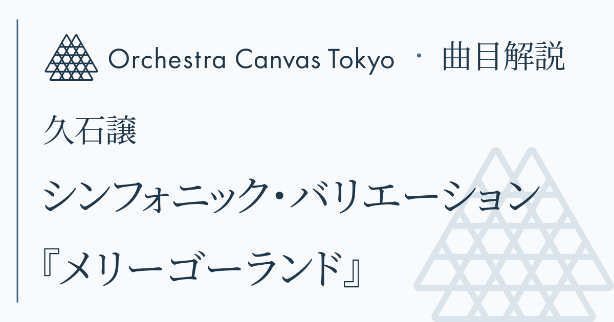

[Full-size PNG](20240909-symphonic-variations-merry-go-around.png)

## 13. 20240910-beethoven-symphony-2

Composer: ベートーヴェン

Card title: 交響曲第2番

Main title row: 1

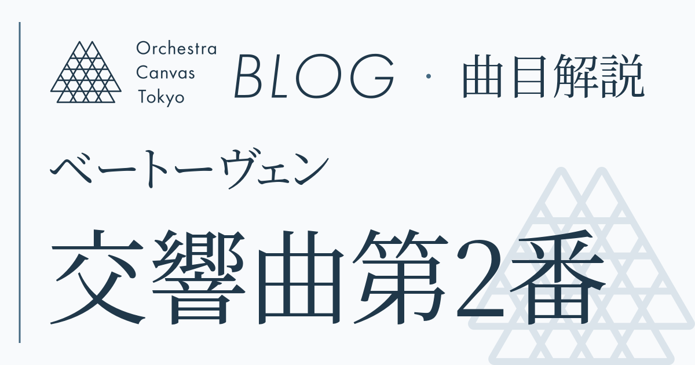

[Full-size PNG](20240910-beethoven-symphony-2.png)

## 14. 20240910-brahms-symphony-2

Composer: ブラームス

Card title: 交響曲第2番

Main title row: 1

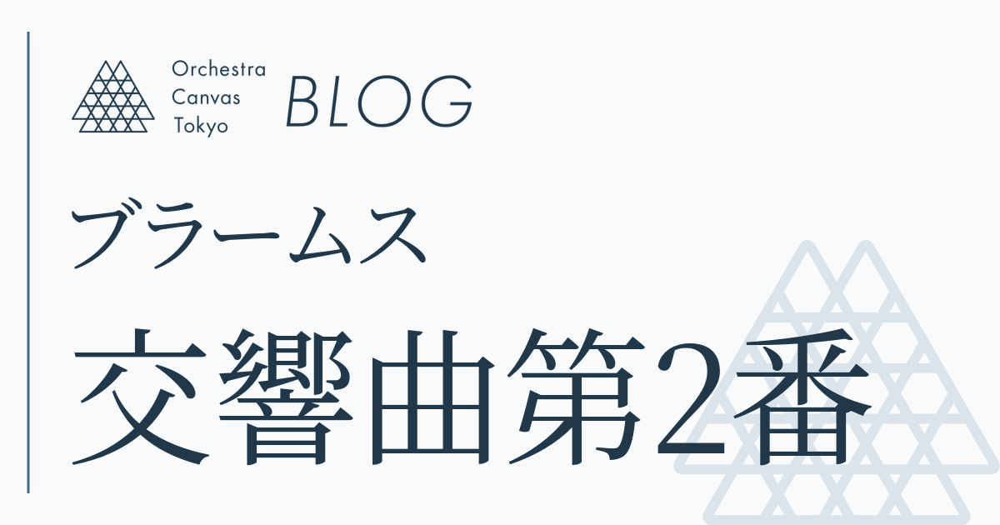

[Full-size PNG](20240910-brahms-symphony-2.png)

## 15. 20240910-idomeneo-overture

Composer: モーツァルト

Card title: 歌劇『イドメネオ』序曲

Main title row: 1

[Full-size PNG](20240910-idomeneo-overture.png)

## 16. 20250118-bruckner-symphony-8

Composer: ブルックナー

Card title: 交響曲第8番

Main title row: 1

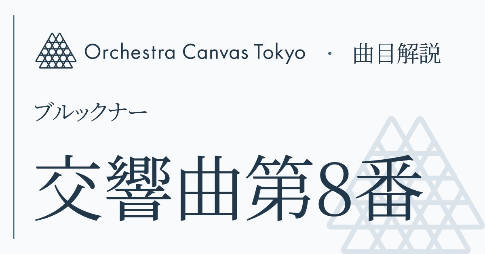

[Full-size PNG](20250118-bruckner-symphony-8.png)

## 17. 20250118-wagner-tristan-and-iseult

Composer: ワーグナー

Card title: 楽劇『トリスタンとイゾルデ』より / 前奏曲と愛の死

Main title row: 2

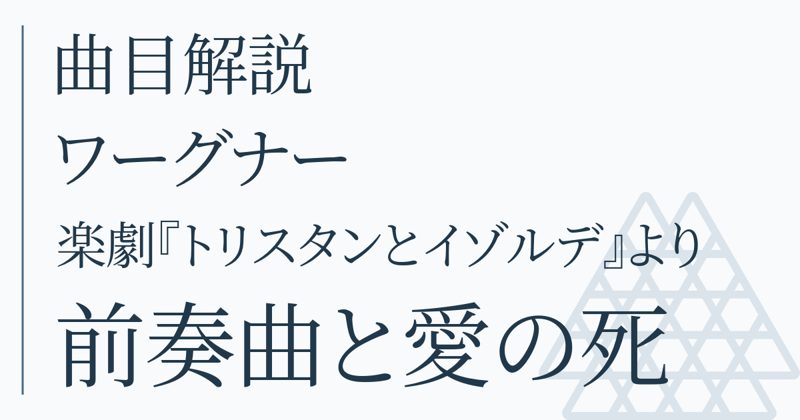

[Full-size PNG](20250118-wagner-tristan-and-iseult.png)

## 18. mendelssohn-midsummer-nights-dream

Composer: メンデルスゾーン

Card title: 真夏の夜の夢

Main title row: 1

[Full-size PNG](mendelssohn-midsummer-nights-dream.png)

## 19. schumann-symphony-2

Composer: シューマン

Card title: 交響曲第2番

Main title row: 1

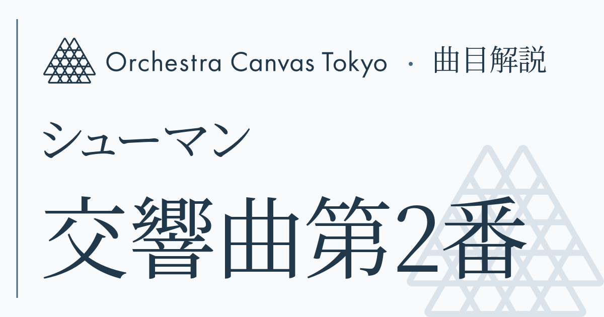

[Full-size PNG](schumann-symphony-2.png)

## 20. 20251111-stravinsky-the-firebird-suite

Composer: ストラヴィンスキー

Card title: バレエ音楽『火の鳥』組曲 / （1945年版）

Main title row: 1

[Full-size PNG](20251111-stravinsky-the-firebird-suite.png)

## 21. 20251111-tchaikovsky-violin-concerto

Composer: チャイコフスキー

Card title: ヴァイオリン協奏曲

Main title row: 1

[Full-size PNG](20251111-tchaikovsky-violin-concerto.png)

## 22. 20251111-tchaikovsky-waltz-from-eugene-onegin

Composer: チャイコフスキー

Card title: 歌劇《エフゲニー・オネーギン》より / 〈ワルツ〉

Main title row: 2

[Full-size PNG](20251111-tchaikovsky-waltz-from-eugene-onegin.png)

## 23. 20250131-marquez-danzon-no2

Composer: マルケス

Card title: ダンソン 第2番

Main title row: 1

[Full-size PNG](20250131-marquez-danzon-no2.png)

## 24. 20260131-bartok-romanian-folk-dances

Composer: バルトーク

Card title: ルーマニア民俗舞曲

Main title row: 1

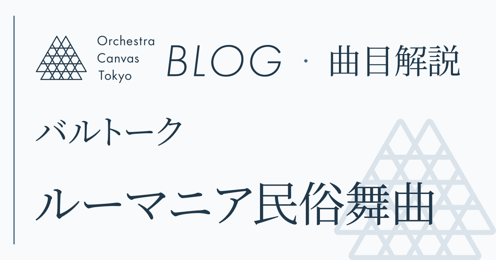

[Full-size PNG](20260131-bartok-romanian-folk-dances.png)

## 25. 20260131-bernstein-symphonic-dance

Composer: バーンスタイン

Card title: 「ウェストサイドストーリー」より / シンフォニックダンス

Main title row: 2

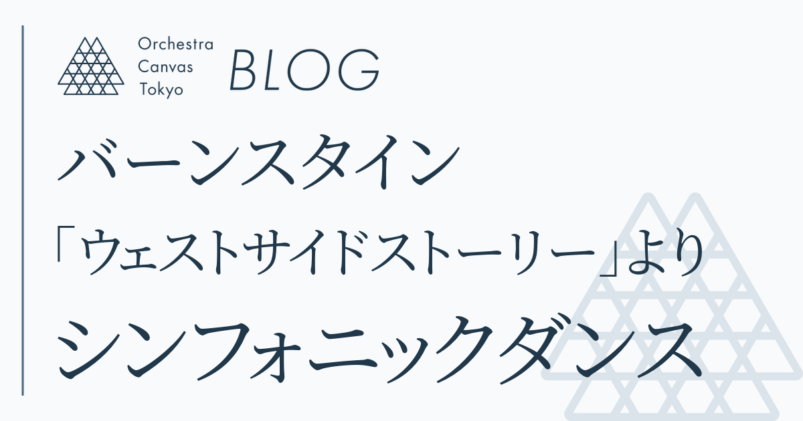

[Full-size PNG](20260131-bernstein-symphonic-dance.png)

## 26. 20260131-liszt-mephisto-waltz

Composer: リスト

Card title: メフィスト・ワルツ第1番 / 「村の居酒屋での踊り」

Main title row: 1

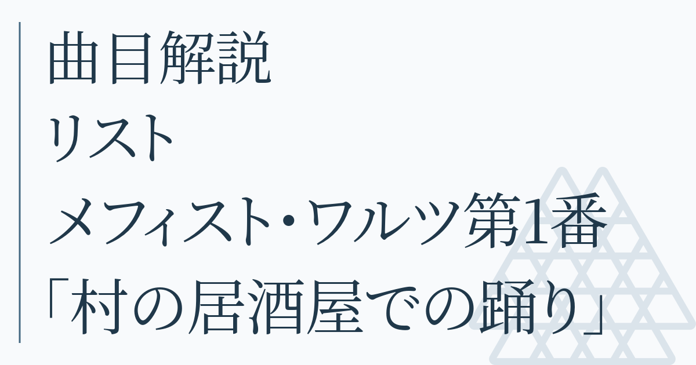

[Full-size PNG](20260131-liszt-mephisto-waltz.png)

## 27. 20260131-saint-saens-danse-macabre

Composer: サン＝サーンス

Card title: 交響詩《死の舞踏》

Main title row: 1

[Full-size PNG](20260131-saint-saens-danse-macabre.png)

## 28. 20260131-strauss2-kaiser-walzer

Composer: ヨハン・シュトラウス2世

Card title: 皇帝円舞曲

Main title row: 1

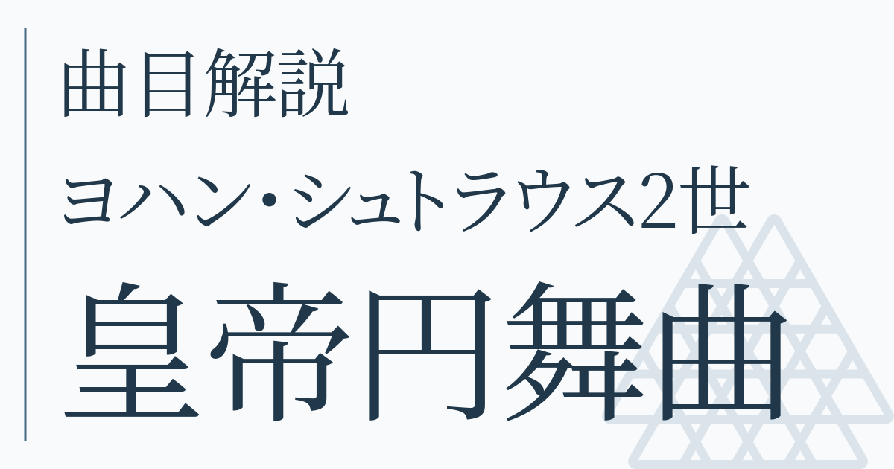

[Full-size PNG](20260131-strauss2-kaiser-walzer.png)

## 29. 20260724-mozart-haffner-symphony

Composer: モーツァルト

Card title: 交響曲第35番 / 『ハフナー』

Main title row: 1

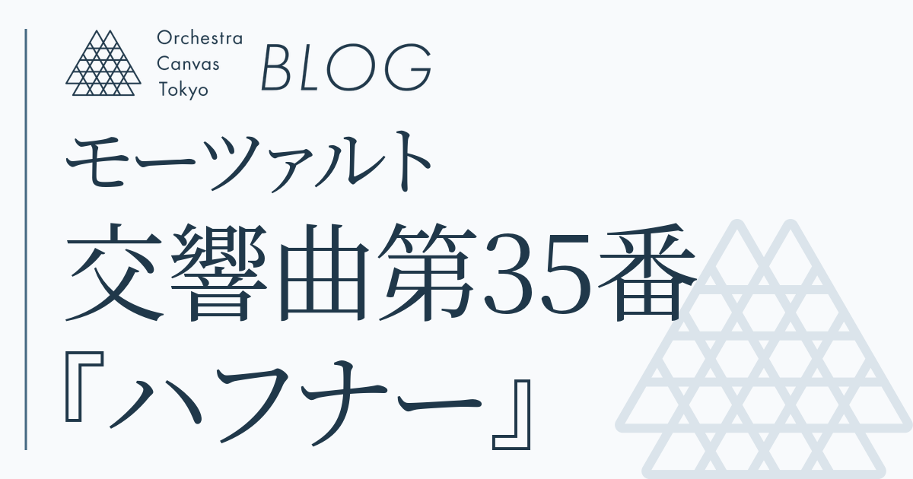

[Full-size PNG](20260724-mozart-haffner-symphony.png)

## 30. 20260724-r-strauss-alpine-symphony

Composer: R.シュトラウス

Card title: アルプス交響曲

Main title row: 1

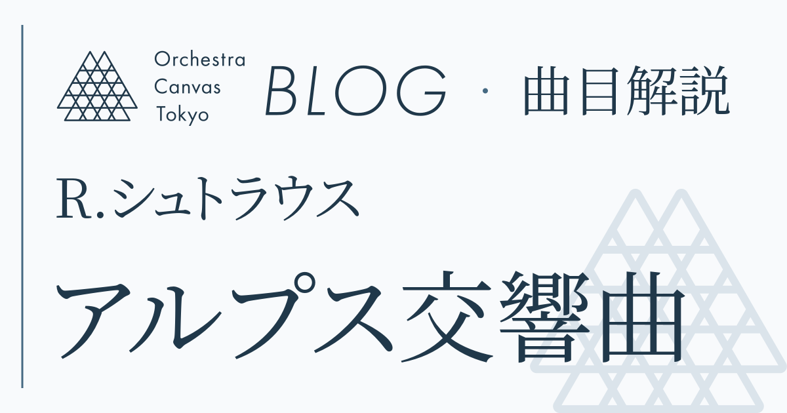

[Full-size PNG](20260724-r-strauss-alpine-symphony.png)

## 31. 20220814-an-american-in-paris

Composer: ガーシュウィン

Card title: パリのアメリカ人

Main title row: 1

[Full-size PNG](20220814-an-american-in-paris.png)

## 32. 20220814-appalachian-spring

Composer: コープランド

Card title: バレエ音楽「アパラチアの春」組曲

Main title row: 1

[Full-size PNG](20220814-appalachian-spring.png)

## 33. 20220814-dvorak-symphony-09

Composer: ドヴォルザーク

Card title: 交響曲第9番《新世界より》

Main title row: 1

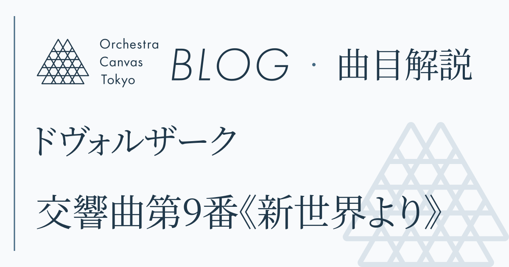

[Full-size PNG](20220814-dvorak-symphony-09.png)

## 34. 20220821-larlesienne

Composer: ビゼー

Card title: 《アルルの女》第2組曲

Main title row: 1

[Full-size PNG](20220821-larlesienne.png)

## 35. 20220821-spain

Composer: シャブリエ

Card title: 狂詩曲《スペイン》

Main title row: 1

[Full-size PNG](20220821-spain.png)

## 36. 20220821-symphonie-fantastique

Composer: ベルリオーズ

Card title: 幻想交響曲

Main title row: 1

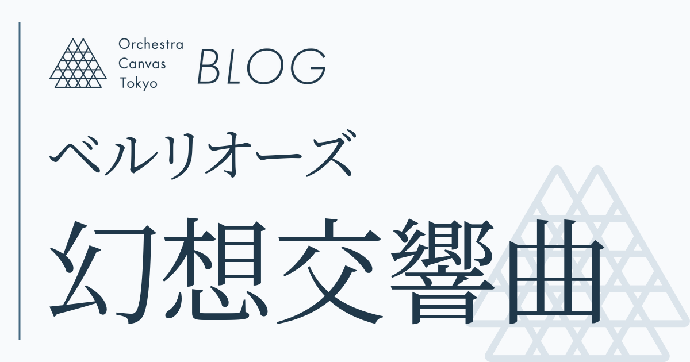

[Full-size PNG](20220821-symphonie-fantastique.png)

## 37. 20220828-rachmaninoff-pfconcerto-03

Composer: ラフマニノフ

Card title: ピアノ協奏曲第3番

Main title row: 1

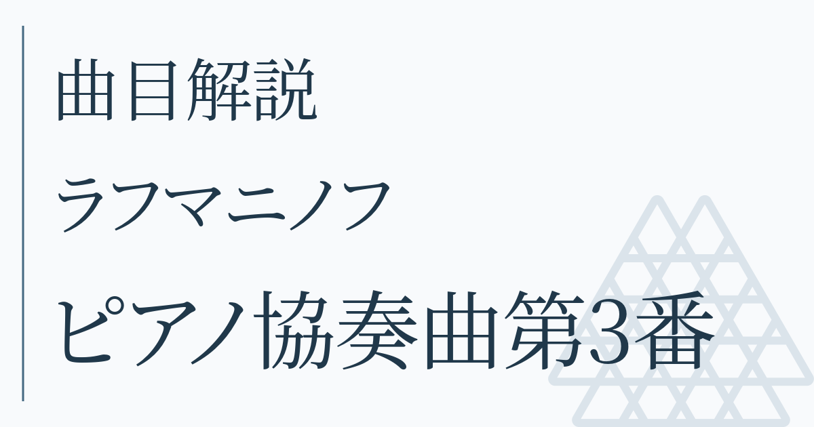

[Full-size PNG](20220828-rachmaninoff-pfconcerto-03.png)

## 38. 20220828-symphonic-dances

Composer: ラフマニノフ

Card title: 《交響的舞曲》

Main title row: 1

[Full-size PNG](20220828-symphonic-dances.png)

## 39. 20220828-toteninsel

Composer: ラフマニノフ

Card title: 交響詩《死の島》

Main title row: 1

[Full-size PNG](20220828-toteninsel.png)

## 40. 20221125-mahler-symphony-01

Composer: マーラー

Card title: 交響曲第1番

Main title row: 1

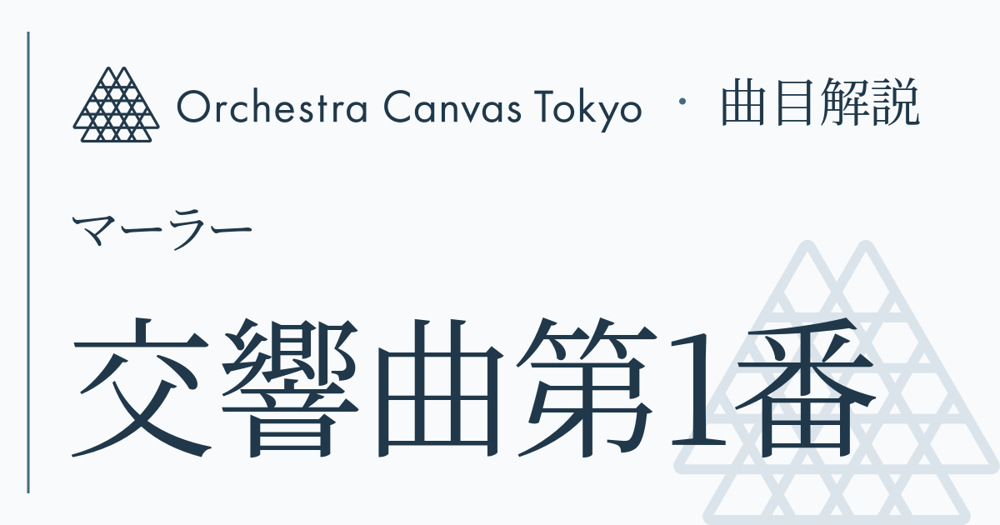

[Full-size PNG](20221125-mahler-symphony-01.png)

## 41. 20221129-don-giovanni

Composer: モーツァルト

Card title: 歌劇『ドン・ジョヴァンニ』：序曲

Main title row: 1

[Full-size PNG](20221129-don-giovanni.png)

## 42. 20221202-tod-und-verklarung

Composer: R.シュトラウス

Card title: 交響詩《死と変容》

Main title row: 1

[Full-size PNG](20221202-tod-und-verklarung.png)

## 43. 20230402-dvorak-cello-concerto

Composer: ドヴォルザーク

Card title: チェロ協奏曲

Main title row: 1

[Full-size PNG](20230402-dvorak-cello-concerto.png)

## 44. 20230410-smetana-ma-vlast

Composer: スメタナ

Card title: 連作交響曲《我が祖国》

Main title row: 1

[Full-size PNG](20230410-smetana-ma-vlast.png)

## 45. 20230708-beethoven-and-orchestra

Composer: 音楽コラム

Card title: ベートーヴェンとオーケストラ

Main title row: 1

[Full-size PNG](20230708-beethoven-and-orchestra.png)

## 46. 20230708-coriolan-overture

Composer: ベートーヴェン

Card title: 『コリオラン』序曲

Main title row: 1

[Full-size PNG](20230708-coriolan-overture.png)

## 47. 20230708-symphony-07

Composer: ベートーヴェン

Card title: 交響曲第7番

Main title row: 1

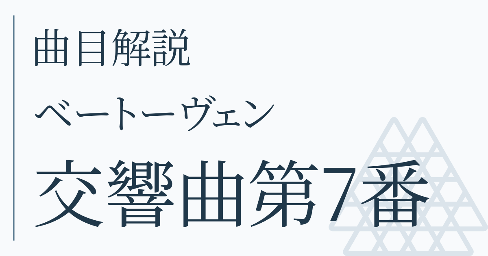

[Full-size PNG](20230708-symphony-07.png)

## 48. 20230708-symphony-08

Composer: ベートーヴェン

Card title: 交響曲第8番

Main title row: 1

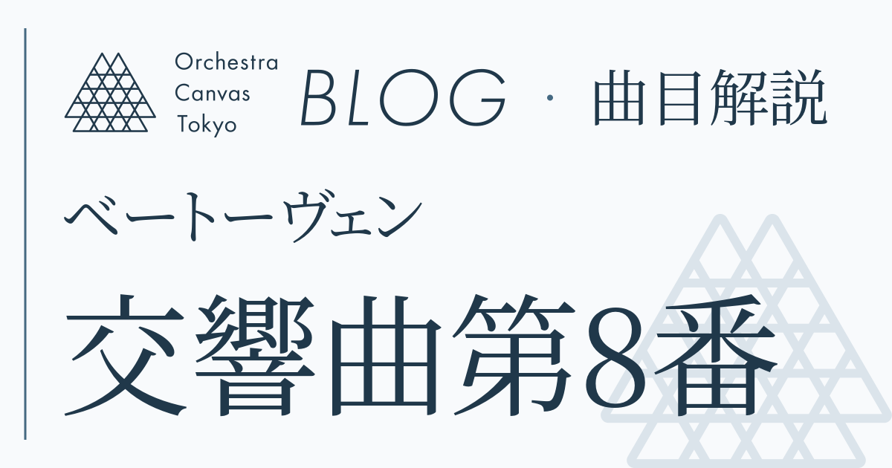

[Full-size PNG](20230708-symphony-08.png)

## 49. 20231006-sibelius-violin-concerto

Composer: シベリウス

Card title: ヴァイオリン協奏曲

Main title row: 1

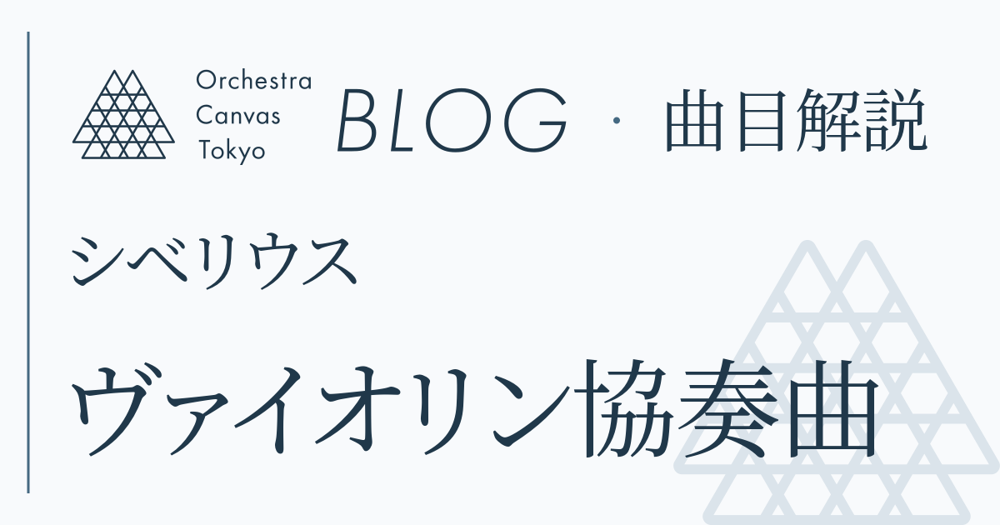

[Full-size PNG](20231006-sibelius-violin-concerto.png)

## 50. 20231006-tchaikovsky-symphony-5

Composer: チャイコフスキー

Card title: 交響曲第5番

Main title row: 1

[Full-size PNG](20231006-tchaikovsky-symphony-5.png)

## 51. 20231006-three-cornered-hat

Composer: ファリャ

Card title: バレエ音楽《三角帽子》第2組曲

Main title row: 1

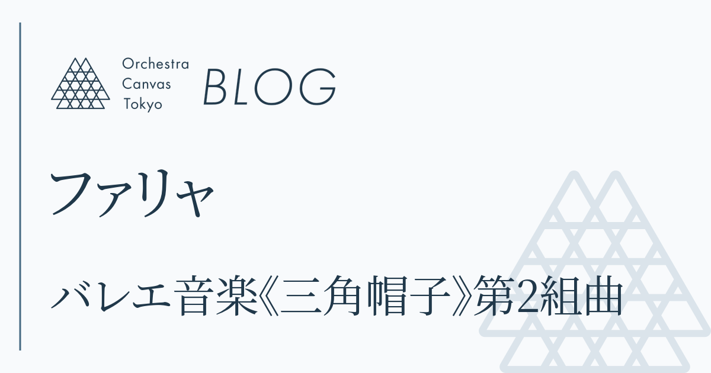

[Full-size PNG](20231006-three-cornered-hat.png)

## 52. 20240208-elgar-in-the-south

Composer: エルガー

Card title: 『南国にて』

Main title row: 1

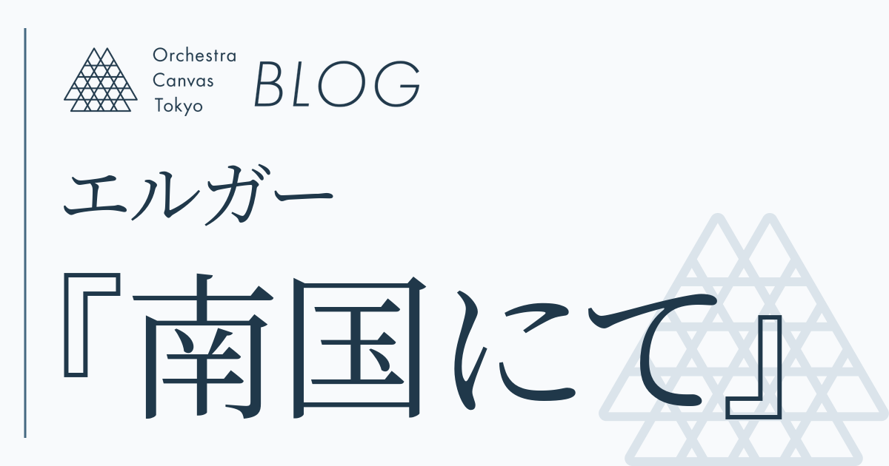

[Full-size PNG](20240208-elgar-in-the-south.png)

## 53. 20240209-elgar-enigma-variations

Composer: エルガー

Card title: 独創主題による変奏曲『エニグマ』

Main title row: 1

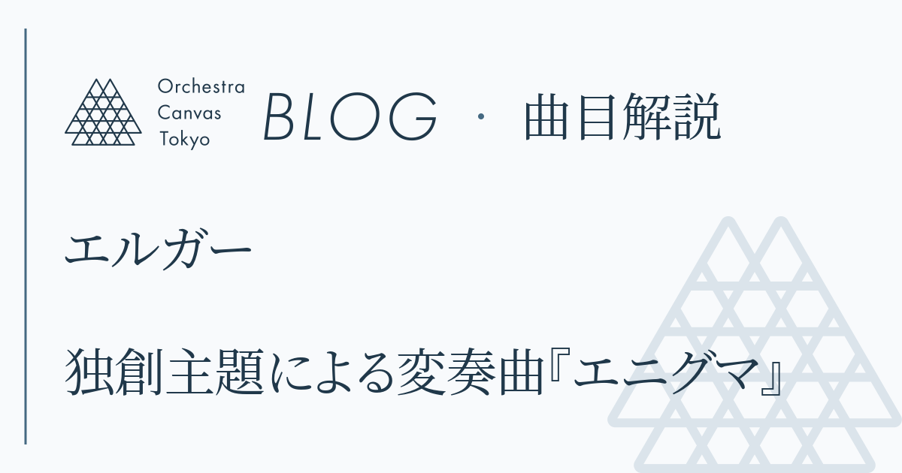

[Full-size PNG](20240209-elgar-enigma-variations.png)

## 54. 20240216-elgar-symphony-1

Composer: エルガー

Card title: 交響曲第1番

Main title row: 1

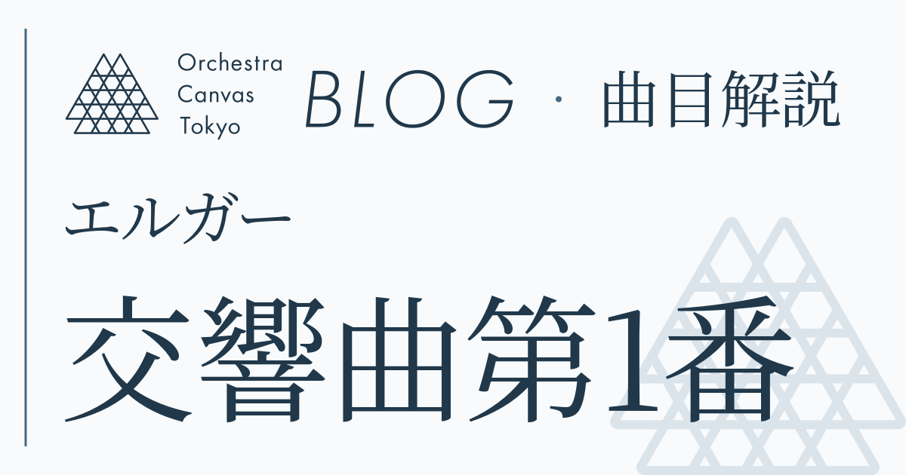

[Full-size PNG](20240216-elgar-symphony-1.png)
