# PR #69 の譜例表示比較

元の WebP 表示と、横スクロールを廃止した SVG 表示の比較です。
各画像には譜例、キャプション、直前・直後の本文を含めています。

- 元画像: `a566bc80c3079c2198efd81b7786d9d6b8d88e7f`（PR の基点）
- 新画像: この比較画像を追加したコミットの実装
- Chromium、画面幅 1280px / 375px、deviceScaleFactor 1、同じ記事 URL・同じ本文・同じフォント
- モバイルでは小節ごとに改行した SVG を表示し、デスクトップでは一段の SVG を画面幅に収めています。
- 320px / 375px / 600px / 601px / 768px / 1280px の各幅で、4譜例とページに横はみ出しがないことを確認しました。

## デスクトップ（1280px）

| 譜例 | 元の WebP                             | 新しい SVG                             |
| ---- | ------------------------------------- | -------------------------------------- |
| 1    | 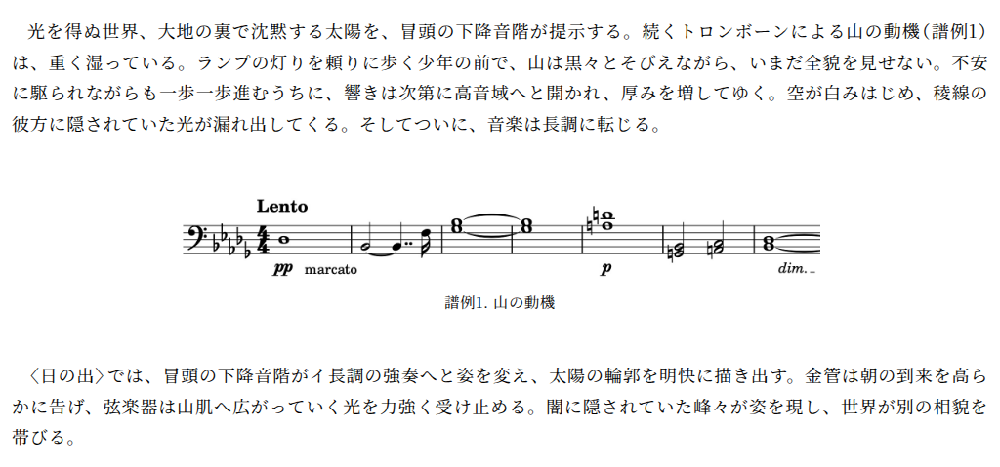 | 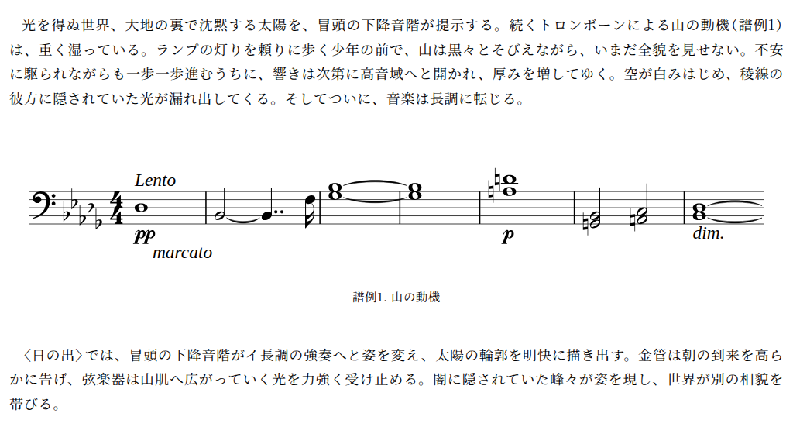 |
| 2    | 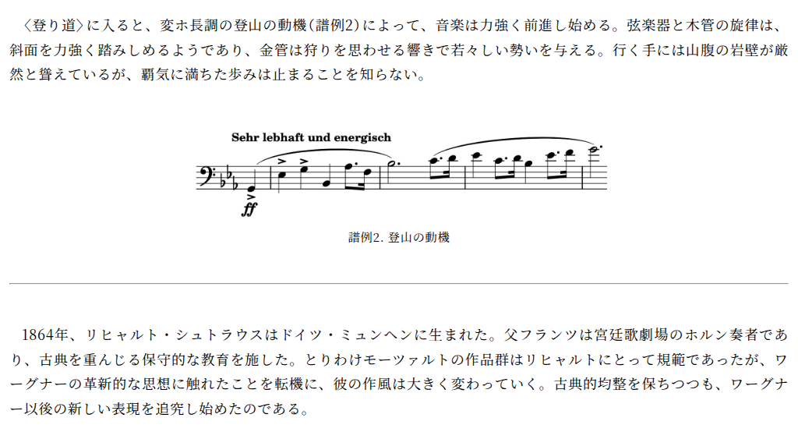 | 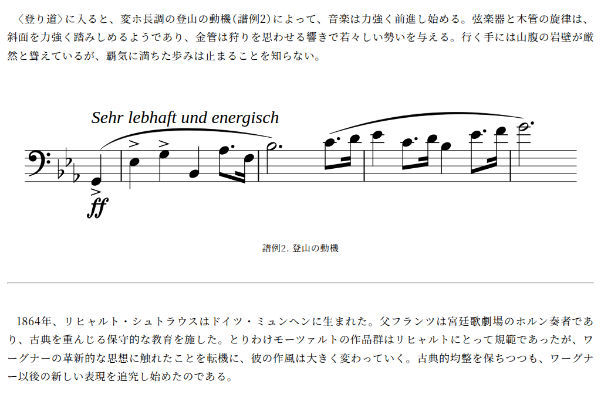 |
| 3    | 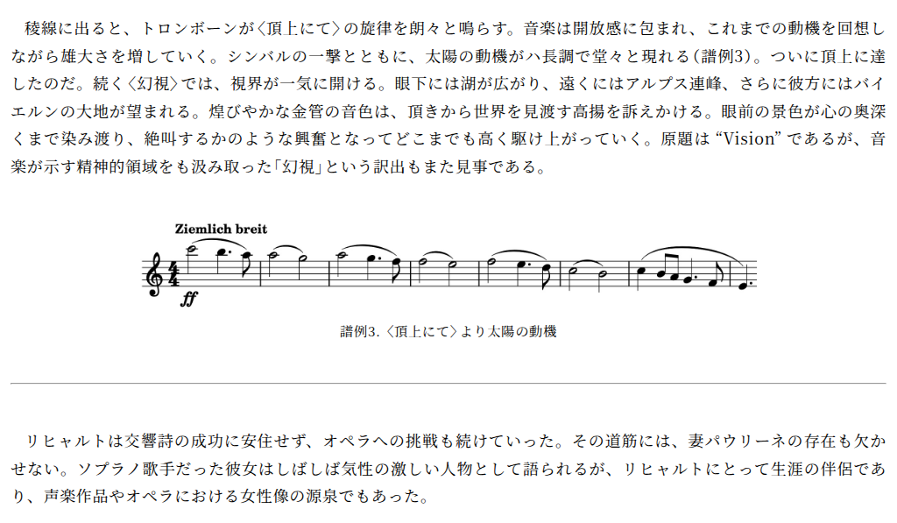 | 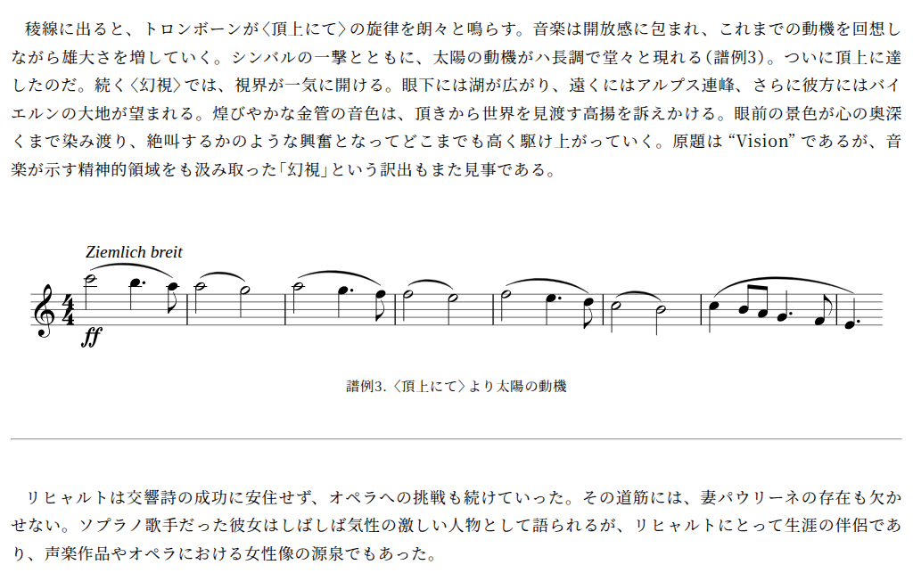 |
| 4    | 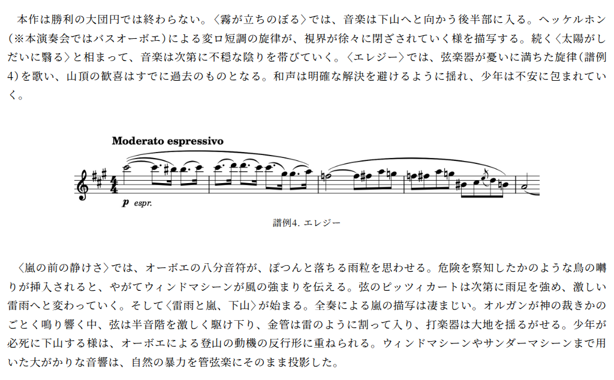 | 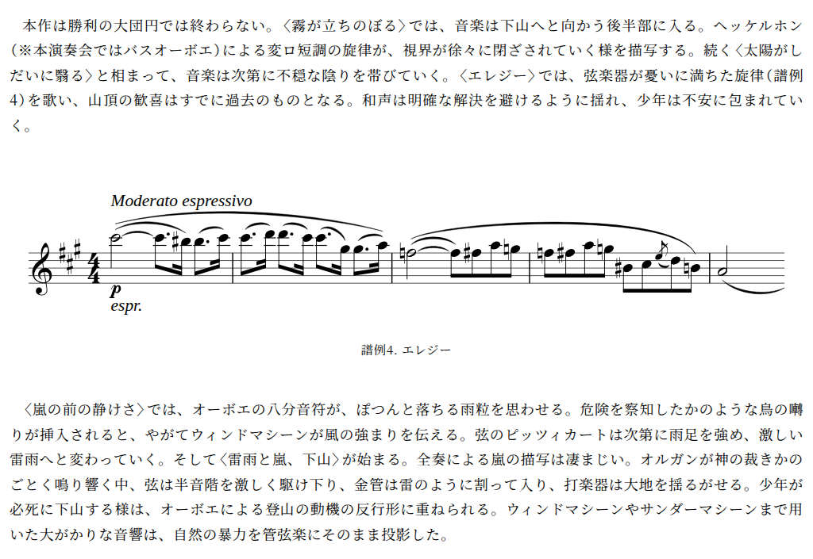 |

## モバイル（375px）

| 譜例 | 元の WebP                            | 新しい SVG                            |
| ---- | ------------------------------------ | ------------------------------------- |
| 1    | 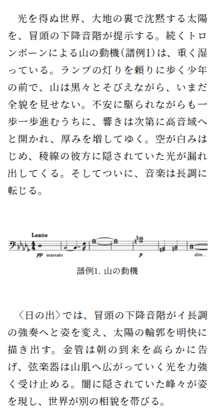 | 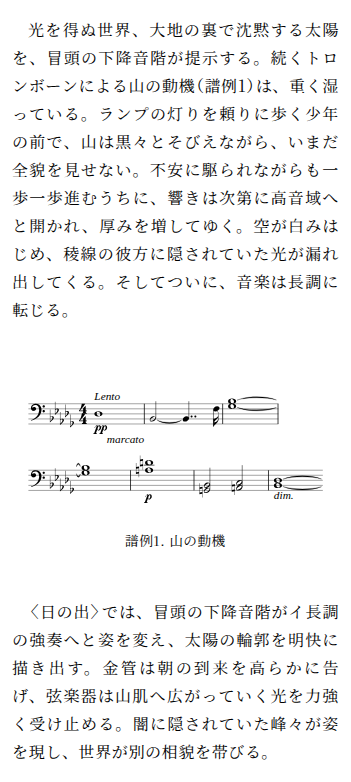 |
| 2    | 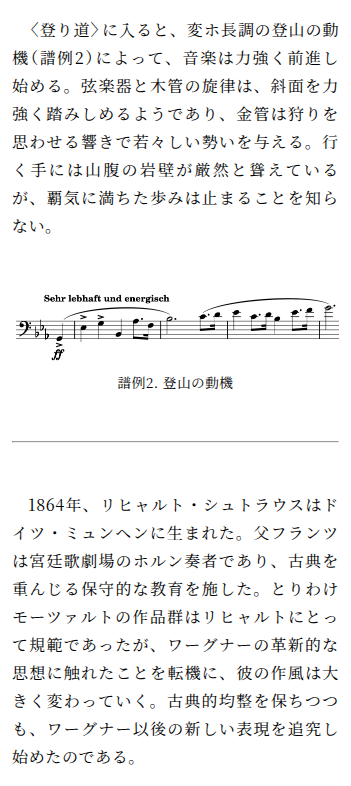 | 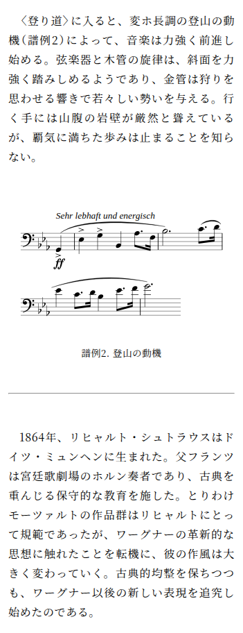 |
| 3    | 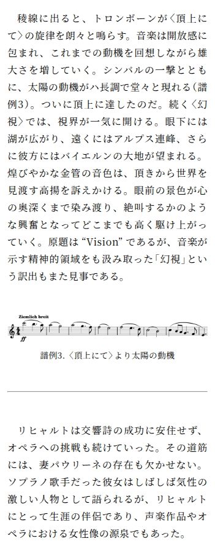 | 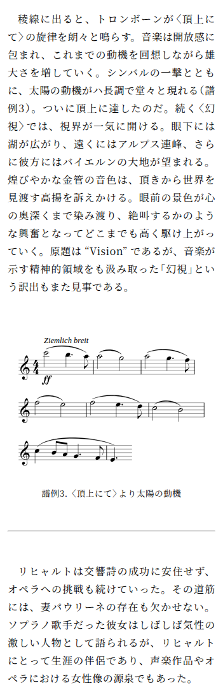 |
| 4    | 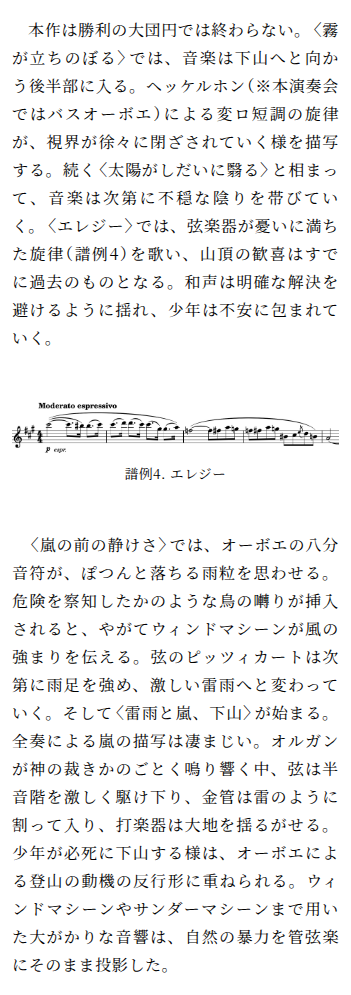 | 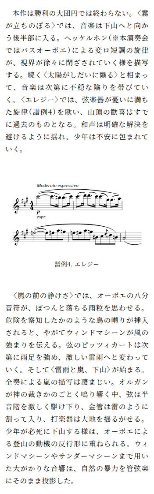 |
